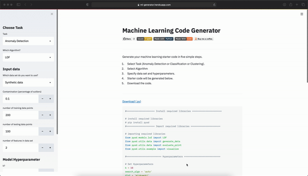

# MLGenerator: Machine Learning Code Generator



A web-app to generate code for different machine learning task.

It is developed in my free time while learning and main motivation is to help machine learning beginers with starter code. 

Try out MLGenerator : [https://ml-generator.herokuapp.com](https://ml-generator.herokuapp.com)

MLGenerator is simple web based machine learning starter code generator, build using [streamlit](https://www.streamlit.io). You can build custom starter code for different machine learning algorithms/tasks such as Regression, Classification, Clustering and Anomaly(Outlier) detection. MLGenerator uses different widely used Python libraries for different task such as Scikit-Learn, PyOD etc.

> MLgenerator is inspired by [traingenerator](https://github.com/jrieke/traingenerator#adding-new-templates) 

## Major Machine Learning Algorithms included in MLGenerator

1. Classification
- Linear Regression
- k-Nearest Neighbors (k-NN)
- Decision Trees
- Random Forest
- Support Vector Machine
- Naive Bayes

2. Clustering
- K-means
- DBSCAN
- OPTICS
- BIRCH

3. Anomaly Detection
- LOF
- iForest
- kNN

4. Dimensionality Reduction
- PCA
- t-SNE

## Installation
To run **MLgenerator** in your local system, you have to install MLgenerator first.

```
git clone https://github.com/durgeshsamariya/MLgenerator.git
cd MLgenerator
pip install -r requirements.txt
```

## Run MLgenerator in your system

```
streamlit run app/main.py
```

## Contribution
If you want to add template in MLgenerator, you can do it by following steps. 

1. Add sidebar method in `./app/sidebars/{Desired Task}.py`. This function should contains a `{Algorithm_Name}_sidebar()` method.
2. Update `./app/main.py` file with appropriate sidebar imports and call method. 
3. Create folder in `./templates/{Desired Task}/`. The folder should be algorithm name.
4. Create code template `code-template.py.jinja` in `./templates/{Desired Task}/{Algorithm Name}`.